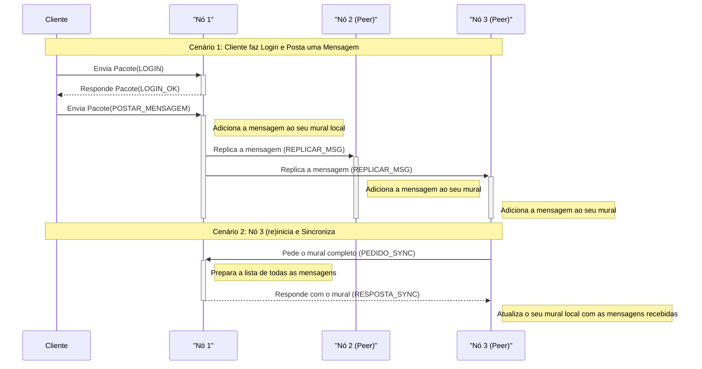

# Serviço de Mensagens Distribuídas com Consistência Eventual

## 1\. Visão Geral

Este projeto, desenvolvido para a disciplina de Sistemas Distribuídos, é uma aplicação em Java que implementa um serviço de mensagens peer-to-peer (P2P) robusto e tolerante a falhas. O sistema simula uma rede de múltiplos nós que mantêm um mural de mensagens compartilhado, aplicando conceitos fundamentais de sistemas distribuídos.

As principais características demonstradas são:

  * **Arquitetura Distribuída P2P:** Um sistema com 3 nós que operam sem uma autoridade central.
  * **Replicação Assíncrona:** As mensagens são propagadas pela rede de forma eficiente e sem bloqueios.
  * **Consistência Eventual:** Garante que, com o tempo, todos os nós da rede convirjam para o mesmo estado.
  * **Autenticação de Utilizadores:** Controla o acesso, permitindo que apenas utilizadores autenticados postem mensagens.
  * **Tolerância a Falhas e Reconciliação:** O sistema simula a falha de um nó e demonstra a sua capacidade de se reintegrar à rede, recuperando o estado perdido.
  * **Persistência de Estado:** O mural de cada nó é salvo em disco, garantindo que os dados sobrevivam a reinicializações completas do sistema.

## 2\. Tecnologias Utilizadas

  * **Linguagem:** Java (versão 1.8 ou superior)
  * **Build Tool:** Apache Maven (para gestão de dependências e empacotamento)
  * **Comunicação:** Sockets TCP/IP para toda a comunicação entre os nós e entre cliente-servidor.

## 3\. Estrutura do Projeto

```
Atividade_8/
│
├── src/
│   └── main/
│       └── java/
│           └── mensageria/
│               ├── Simulador.java          # Classe principal que orquestra a rede e a falha.
│               │
│               ├── cliente/
│               │   └── Cliente.java        # Interface do utilizador para interagir com a rede.
│               │
│               ├── comum/
│               │   ├── Mensagem.java       # Representa uma mensagem no mural.
│               │   ├── Mural.java          # Representa o mural de mensagens (a base de dados).
│               │   └── Pacote.java         # Define o protocolo de comunicação.
│               │
│               └── no/
│                   ├── No.java             # Lógica principal de um nó (servidor e cliente P2P).
│                   └── TratadorDeConexao.java # Thread que lida com cada conexão recebida.
│
├── pom.xml                                 # Ficheiro de configuração do Maven.
├── COMPILAR.bat                            # Script para compilar o projeto.
├── EXECUTAR_REDE.bat                       # Script para iniciar a simulação da rede de nós.
├── EXECUTAR_CLIENTE.bat                    # Script para iniciar um cliente.
└── README.md                               # Este ficheiro.
```

## 4\. Como Executar

Para executar a simulação, certifique-se de que tem o **JDK (1.8 ou superior)** e o **Apache Maven** instalados e configurados nas variáveis de ambiente do seu sistema.

### Passo 1: Compilar o Projeto

Execute o script `COMPILAR.bat`. Este script irá:

1.  Invocar o Maven para limpar compilações antigas (apagando a pasta `target`).
2.  Compilar todo o código-fonte.
3.  Empacotar a aplicação num único ficheiro `.jar` executável com todas as dependências incluídas.

<!-- end list -->

```bash
# Na raiz do projeto, execute:
./COMPILAR.bat
```

> **Importante:** Se fizer qualquer alteração no código-fonte, é **essencial** executar este script novamente para que as suas alterações sejam incluídas no ficheiro `.jar`. Por segurança, antes de compilar, pode apagar manualmente a pasta `target/` para garantir uma compilação limpa.

### Passo 2: Iniciar a Rede de Nós

Execute o script `EXECUTAR_REDE.bat`. Este script inicia a classe `Simulador`, que irá:

1.  Criar e iniciar 3 processos (nós) em threads separadas.
2.  Agendar a falha do **Nó 3** para ocorrer após **60 segundos**.
3.  Manter a rede a funcionar até que a janela do terminal seja fechada.

<!-- end list -->

```bash
# Na raiz do projeto, execute (numa janela de terminal):
./EXECUTAR_REDE.bat
```

### Passo 3: Interagir com a Rede

Execute o script `EXECUTAR_CLIENTE.bat`. Ele irá pedir a porta do nó ao qual deseja conectar-se.

```bash
# Na raiz do projeto, execute (numa nova janela de terminal):
./EXECUTAR_CLIENTE.bat
```

Pode abrir múltiplos clientes em terminais diferentes para simular vários utilizadores a interagir com a rede.

## 5\. Ficheiros Gerados

Ao executar o sistema, alguns ficheiros serão criados na raiz do projeto:

  * **`target/`**: Esta pasta é criada pelo Maven durante a compilação. Contém o código compilado e os ficheiros `.jar` executáveis. É seguro apagar esta pasta a qualquer momento (o `COMPILAR.bat` fá-lo-á automaticamente).
  * **`mural_no_1.dat`, `mural_no_2.dat`, `mural_no_3.dat`**: Estes são os ficheiros de **persistência**. Cada ficheiro armazena o estado do mural de um nó específico. Graças a estes ficheiros, se você parar a rede e a iniciar novamente, as mensagens não serão perdidas. Para começar uma simulação "do zero", apague estes três ficheiros.

## 6\. Como Testar as Funcionalidades

### Teste 1: Autenticação (Acesso Público vs. Privado)

1.  Inicie a rede com `EXECUTAR_REDE.bat`.
2.  Inicie um cliente com `EXECUTAR_CLIENTE.bat` e conecte-se à porta `8001`.
3.  **Ação Privada (Falha):** Sem fazer login, escolha a **opção 3 (Postar)**. A ação será bloqueada com um erro.
4.  **Login:** Escolha a **opção 1 (Fazer Login)** e use as credenciais `anderson` / `123`.
5.  **Ação Privada (Sucesso):** Após o login, escolha novamente a **opção 3 (Postar)**. Agora, a mensagem será enviada com sucesso.
6.  **Ação Pública:** Abra um **segundo cliente** noutro terminal, conecte-se à porta `8002` e, sem fazer login, escolha a **opção 2 (Ler Mural)**. Você verá a mensagem postada pelo utilizador 'anderson'.

### Teste 2: Simulação de Falha

1.  Inicie a rede com `EXECUTAR_REDE.bat`.
2.  Aguarde 60 segundos. Observe os logs na janela da rede. Verá a mensagem `>>> SIMULANDO FALHA DO NÓ 3 <<<`.
3.  Inicie um novo cliente e tente conectar-se à porta do nó que falhou: `8003`.
4.  O cliente irá apresentar um erro de conexão e encerrar, provando que o nó está offline.

### Teste 3: Reconciliação com Persistência (Prova Final)

Este teste prova que o Nó 3 recupera as mensagens que perdeu.

1.  **Limpe o ambiente:** Apague os ficheiros `mural_no_*.dat` da raiz do projeto.
2.  **Inicie a rede:** Execute `EXECUTAR_REDE.bat`.
3.  **Poste mensagens:** Inicie um cliente, conecte-se ao **Nó 1 (porta 8001)**, faça login e poste algumas mensagens.
4.  **Aguarde a falha:** Espere 60 segundos para que o Nó 3 falhe.
5.  **Poste durante a falha:** No mesmo cliente (ou noutro conectado a um nó ativo), poste uma nova mensagem, por exemplo: `"Esta mensagem foi enviada enquanto o Nó 3 estava offline"`.
6.  **Pare a simulação:** Feche a janela da rede (a que executou `EXECUTAR_REDE.bat`).
7.  **Reinicie a rede:** Execute `EXECUTAR_REDE.bat` novamente.
8.  **Observe os logs:** Preste atenção aos logs de inicialização. Você verá:
      * `[Nó 1] Mural carregado do disco com sucesso.` (Ele recuperou a última mensagem).
      * `[Nó 3] Mural carregado do disco com sucesso.` (Ele recuperou o seu estado antigo).
      * `[Nó 3] Sincronização bem-sucedida com a porta 8001. 1 novas mensagens adicionadas.` (Ele "puxou" a mensagem que perdeu do Nó 1).
9.  **Verifique:** Inicie um cliente, conecte-se ao **Nó 3 (porta 8003)** e leia o mural. A mensagem enviada durante a falha estará lá.

## 7\. Diagrama de Sequência do Sistema


